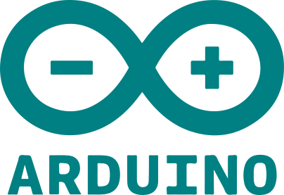

<h1 align="center">Hi 👋, I'm Kaniskar K</h1>
<h3 align="center">A passionate IoT Developer and Frontend Developer from India</h3>

&ensp;

- `IoT` & `Front-end` Developer
- Currently learning `Mern`
- Working on my react website!
- Checkout my other projects!

  

&ensp;

### Connect With Me:

### My stacks:

    <a href="(https://en.wikipedia.org/wiki/C_(programming_language)"> &ensp;&ensp;</a>
    <a href="(https://cplusplus.com/doc/tutorial/)">  &ensp;&ensp;</a>
    <a href="https://www.python.org/">  &ensp;&ensp;</a>
    <a href="https://developer.mozilla.org/en-US/docs/Web/HTML">  &ensp;&ensp;</a>
    

&ensp;

    &ensp;&ensp;
    <a href="https://www.linux.org/">  &ensp;&ensp;</a>
    <a href="https://javascript.info/">  &ensp;&ensp;</a>
    <a href="https://reactjs.org/">  &ensp;&ensp;</a>
    <a href="https://www.mysql.com/">  &ensp;&ensp;</a>
    

    &ensp;
    <a href="https://www.arduino.cc/">  &ensp;&ensp;</a>
    <a href="https://www.espressif.com/en/products/socs/esp8266">  &ensp;</a>
    <a href="https://www.raspberrypi.org/"> &ensp;&ensp;</a>
    <a href="https://developer.nvidia.com/embedded/jetson-nano-developer-kit">  &ensp;</a>
    

&ensp;

    &ensp;&ensp;
    <a href="https://www.ryzerobotics.com/tello">  &ensp;&ensp;</a>
    <a href="https://pjreddie.com/darknet/yolo/">  &ensp;&ensp;</a>
    <a href="https://www.metasploit.com/">  &ensp;&ensp;</a>
    <a href="https://nmap.org/">  &ensp;&ensp;</a>
    <a href="https://www.maltego.com/">  &ensp;&ensp;</a>

&ensp;

&ensp;
